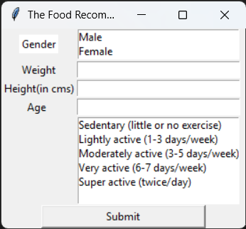

# Diet Recommendation System

This project recommends suitable diet plans based on a user's Body Mass Index (BMI).
It helps users make healthier food choices using simple and effective rule-based logic.

## Features
- Calculates BMI using user height and weight
- Classifies users into BMI categories
- Recommends diet plans for each BMI range
- Simple and beginner-friendly implementation

## Use Cases
- Health and diet planning
- Learning recommendation system fundamentals
- Applying logic to real-world health data

## Screenshots

### Before Entering Details

### After Getting Diet Recommendation

## Technologies Used
- Python
- Conditional logic and basic data structures
